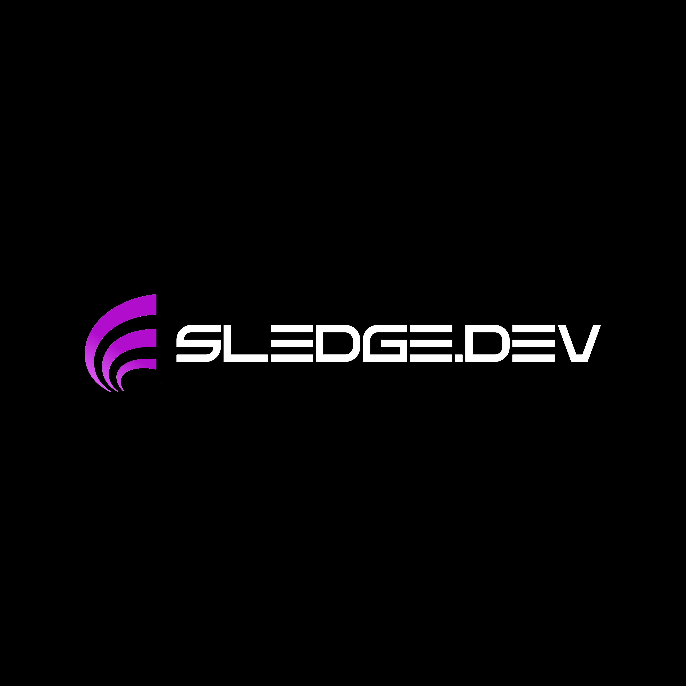

<!-- PROJECT LOGO -->
 

  

  <h3 align="center">AFK Script</h3>

  

    Spieler können eine gewisse Zeit AFK sein
     
    <a href="https://github.com/sledgehamm3r/ESX-QBCore-Converter"><strong>Dokumentation ansehen »</strong></a>
     
     
    <a href="https://github.com/sledgehamm3r/ESX-QBCore-Converter/issues">Bug melden</a>
    ·
    <a href="https://github.com/sledgehamm3r/ESX-QBCore-Converter/issues">Anfrage stellen</a>
  

<!-- TABLE OF CONTENTS -->

  
Inhaltsverzeichnis

  <ol>
    <li>
      <a href="#about-the-project">Über das Projekt</a>
      <ul>
        <li><a href="#built-with">Erstellt mit</a></li>
      </ul>
    </li>
    <li>
      <a href="#getting-started">Verwendung</a>
      <ul>
        <li><a href="#prerequisites">Voraussetzungen</a></li>
        <li><a href="#installation">Installation</a></li>
      </ul>
    </li>
    <li><a href="#usage">Benutzung</a></li>
    <li><a href="#roadmap">Roadmap</a></li>
    <li><a href="#contributing">Contributing</a></li>
    <li><a href="#license">License</a></li>
    <li><a href="#contact">Kontakt</a></li>
    <li><a href="#acknowledgments">Danksagungen</a></li>
  </ol>

<!-- ABOUT THE PROJECT -->
## Über das Projekt

🛠️ The "Script Converter" is a versatile tool designed to facilitate the conversion of scripts between ESX and QBCore frameworks in the FiveM environment.

It provides a user-friendly interface for selecting a folder containing script files and a file containing replacements. The tool recursively processes all script files with specified extensions (.lua, .html, .js) within the selected folder and its subdirectories.

It performs string replacements based on the pairs of search and replacement text provided in the replacement file. Upon completion, it displays a list of processed files and notifies the user of successful completion.

However, users should review the revised scripts and keep an eye on the console for any potential errors. 👀🔍🚧

German:
🛠️ Der "Script Converter" ist ein vielseitiges Tool, das die Konvertierung von Skripten zwischen den ESX- und QBCore-Frameworks in der FiveM-Umgebung erleichtert.

Es bietet eine benutzerfreundliche Oberfläche zur Auswahl eines Ordners mit Skriptdateien und einer Datei mit Ersetzungen. Das Tool verarbeitet rekursiv alle Skriptdateien mit den angegebenen Erweiterungen (.lua, .html, .js) innerhalb des ausgewählten Ordners und seiner Unterverzeichnisse.

Es führt Zeichenfolgenersetzung basierend auf den Paaren von Such- und Ersatztext durch, die in der Ersetzungsdatei angegeben sind. Nach Abschluss zeigt es eine Liste der verarbeiteten Dateien an und informiert den Benutzer über den erfolgreichen Abschluss.

Dennoch sollten Benutzer die überarbeiteten Skripte überprüfen und die Konsole im Blick behalten, um mögliche Fehler zu erkennen. 👀🔍🚧

(<a href="#readme-top">Zurück nach oben</a>)

<!-- CONTRIBUTING -->
## Contributing

Contributions are what make the open-source community an amazing place to learn, be inspired, and create. Any contributions you make are greatly appreciated.

If you have an improvement idea, please fork the repository and create a pull request. You can also simply open an issue tagged as "enhancement".
Don't forget to give the project a star! Thank you again!

Fork the project
Create a feature branch (git checkout -b feature/AmazingFeature)
Commit your changes (git commit -m 'Add some amazing feature')
Push the branch (git push origin feature/AmazingFeature)
Open a pull request

(<a href="#readme-top">Back to Top</a>)

<!-- LICENSE -->
## License
Released under the MIT License. For more information, please refer to the LICENSE.txt file.

(<a href="#readme-top">Zurück nach Oben</a>)

<!-- CONTACT -->

<!-- MARKDOWN LINKS & IMAGES -->
<!-- https://www.markdownguide.org/basic-syntax/#reference-style-links -->
[contributors-shield]: https://img.shields.io/github/contributors/othneildrew/Best-README-Template.svg?style=for-the-badge
[contributors-url]: https://github.com/othneildrew/Best-README-Template/graphs/contributors
[forks-shield]: https://img.shields.io/github/forks/othneildrew/Best-README-Template.svg?style=for-the-badge
[forks-url]: https://github.com/othneildrew/Best-README-Template/network/members
[stars-shield]: https://img.shields.io/github/stars/othneildrew/Best-README-Template.svg?style=for-the-badge
[stars-url]: https://github.com/othneildrew/Best-README-Template/stargazers
[issues-shield]: https://img.shields.io/github/issues/othneildrew/Best-README-Template.svg?style=for-the-badge
[issues-url]: https://github.com/othneildrew/Best-README-Template/issues
[license-shield]: https://img.shields.io/github/license/othneildrew/Best-README-Template.svg?style=for-the-badge
[license-url]: https://github.com/othneildrew/Best-README-Template/blob/master/LICENSE.txt
[linkedin-shield]: https://img.shields.io/badge/-LinkedIn-black.svg?style=for-the-badge&logo=linkedin&colorB=555
[linkedin-url]: https://linkedin.com/in/othneildrew
[product-screenshot]: images/screenshot.png
[Next.js]: https://img.shields.io/badge/next.js-000000?style=for-the-badge&logo=nextdotjs&logoColor=white
[Next-url]: https://nextjs.org/
[React.js]: https://img.shields.io/badge/HTML-20232A?style=for-the-badge&logo=html&logoColor=61DAFB
[React-url]: https://reactjs.org/
[Vue.js]: https://img.shields.io/badge/Vue.js-35495E?style=for-the-badge&logo=vuedotjs&logoColor=4FC08D
[Vue-url]: https://vuejs.org/
[Angular.io]: https://img.shields.io/badge/Angular-DD0031?style=for-the-badge&logo=angular&logoColor=white
[Angular-url]: https://angular.io/
[Svelte.dev]: https://img.shields.io/badge/Svelte-4A4A55?style=for-the-badge&logo=svelte&logoColor=FF3E00
[Svelte-url]: https://svelte.dev/
[Laravel.com]: https://img.shields.io/badge/Laravel-FF2D20?style=for-the-badge&logo=laravel&logoColor=white
[Laravel-url]: https://laravel.com
[Bootstrap.com]: https://img.shields.io/badge/Bootstrap-563D7C?style=for-the-badge&logo=bootstrap&logoColor=white
[Bootstrap-url]: https://getbootstrap.com
[JQuery.com]: https://img.shields.io/badge/jQuery-0769AD?style=for-the-badge&logo=jquery&logoColor=white
[JQuery-url]: https://jquery.com 
